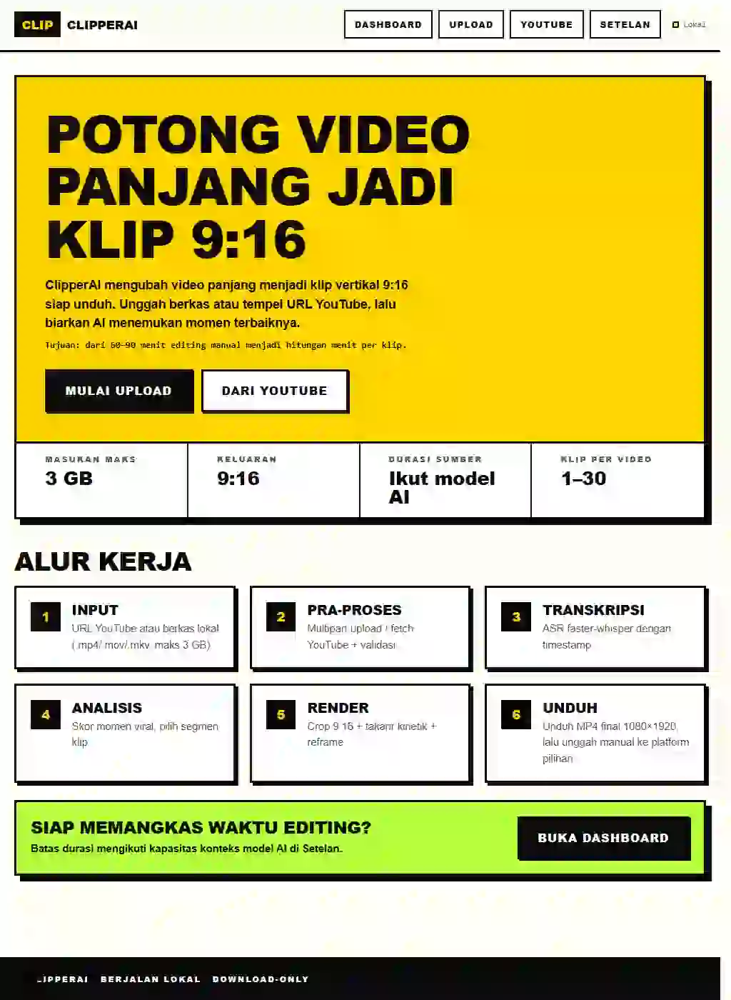
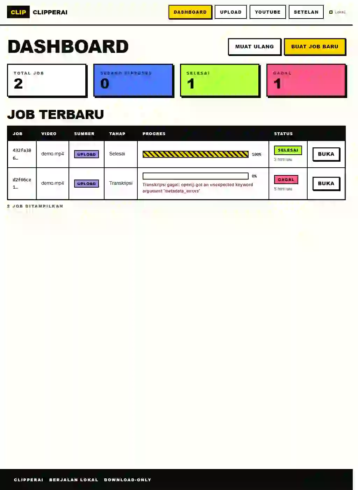
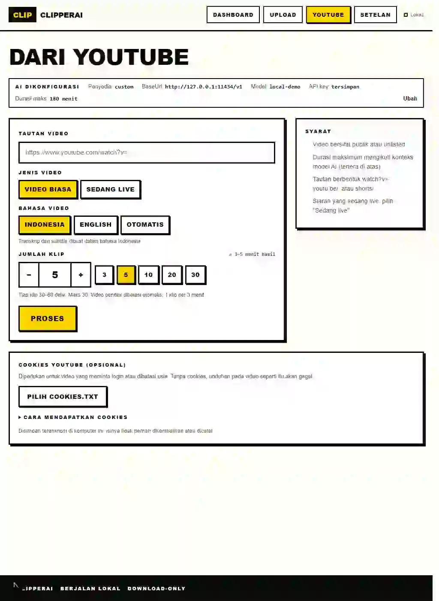
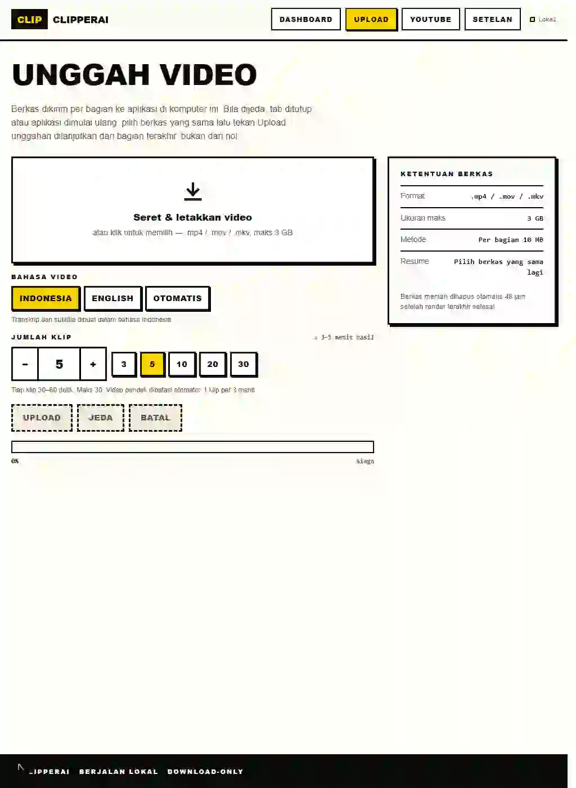
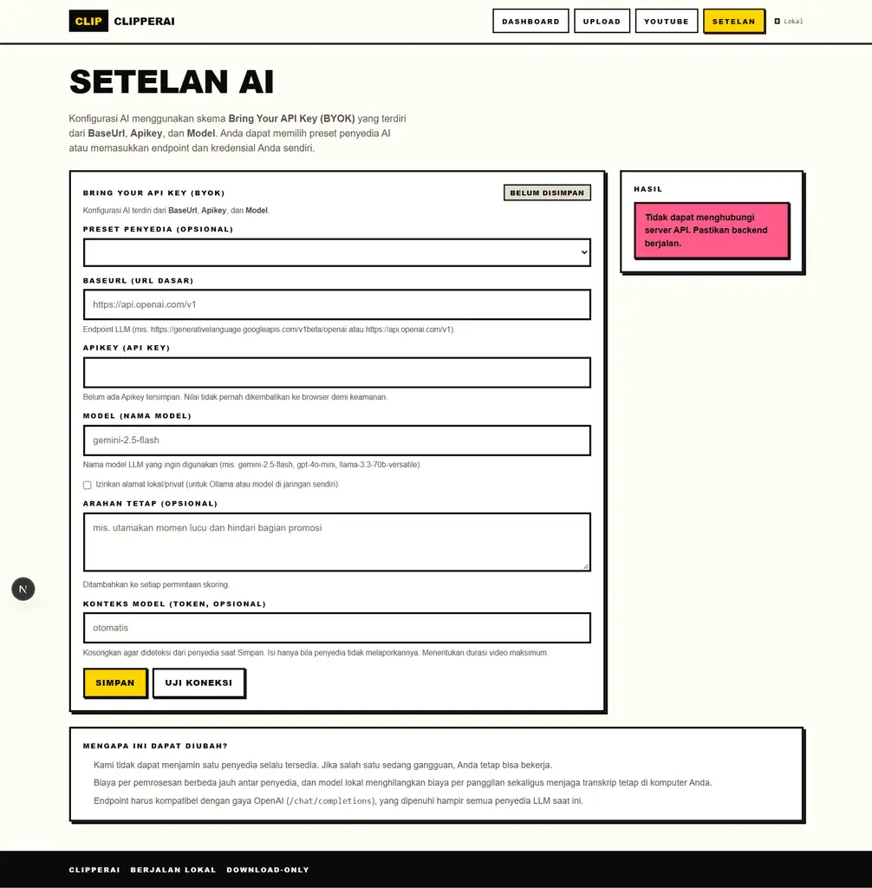
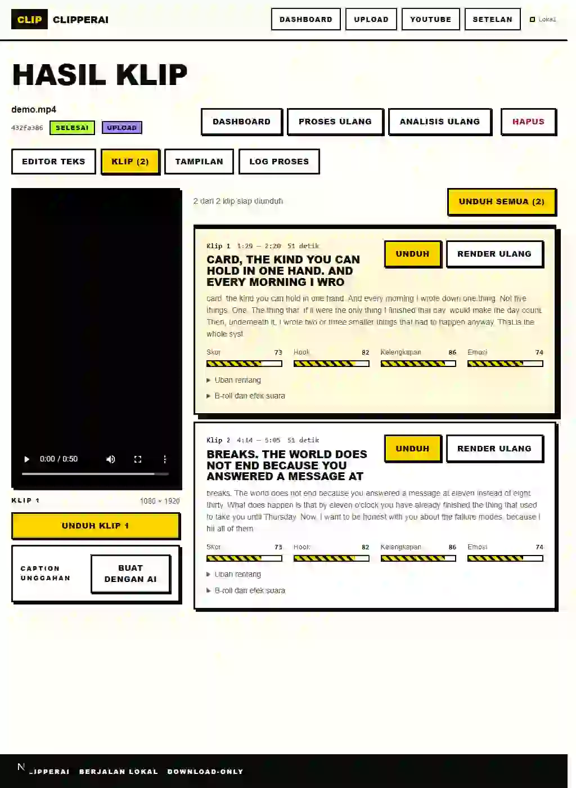

# ClipperAI

Mengubah video panjang (YouTube atau berkas lokal) menjadi klip vertikal 9:16
dengan subtitle karaoke. AI memilih momen terbaik, wajah pembicara dijaga di
tengah bingkai, dan hasilnya siap diunggah ke TikTok, Reels, atau Shorts.

Berjalan di Windows tanpa Docker, WSL, PostgreSQL, atau Redis.

## Fitur

- **Input fleksibel** — proses video dari tautan YouTube publik/unlisted atau berkas lokal `.mp4`, `.mov`, dan `.mkv` hingga 3 GB.
- **Upload yang dapat dilanjutkan** — unggahan berkas dikirim per bagian dan dapat diteruskan setelah jeda, tab ditutup, atau aplikasi dimulai ulang.
- **Transkripsi bertimestamp** — gunakan subtitle YouTube bila tersedia; jika tidak, faster-whisper berjalan lokal di CPU.
- **Pemilihan momen dengan AI** — AI menganalisis transkrip dan memilih momen terbaik sesuai jumlah klip yang diminta.
- **Klip vertikal siap unduh** — render 9:16 dengan crop/reframe pembicara, subtitle karaoke kinetik, dan output MP4 hingga 1080×1920.
- **Review dan penyuntingan** — ubah transkrip, rentang klip, caption, overlay/B-roll, efek suara, mode crop, dan gaya subtitle sebelum render ulang.
- **Konfigurasi AI BYOK** — dukung Gemini, OpenAI, Groq, OpenRouter, Ollama, serta endpoint yang kompatibel dengan OpenAI; API key disimpan terenkripsi dan tidak ditampilkan kembali.
- **Berjalan lokal** — database, media sumber, render, font, dan rahasia YouTube disimpan di komputer pengguna; publikasi otomatis ke platform sosial belum termasuk.

## Mulai

Butuh **Python 3.12–3.14** dan **Node.js 22+**. Lalu, dari folder proyek:

```cmd
npm run dev
```

atau klik dua kali **`start.cmd`**. Pemakaian pertama memasang semuanya
otomatis (~10 menit). Buka <http://localhost:3000>, isi penyedia AI di
**Setelan**, lalu kirim video. Berhenti dengan Ctrl+C atau `stop.cmd`.

## Dokumentasi

Semua dokumentasi ada di folder [`docs/`](docs/README.md):

- [Mulai cepat](docs/panduan/mulai-cepat.md) — prasyarat, menjalankan, menghentikan
- [Pemakaian](docs/panduan/pemakaian.md) — penyedia AI, batas, lokasi hasil klip
- [Pemecahan masalah](docs/panduan/pemecahan-masalah.md)
- [Arsitektur](docs/pengembangan/arsitektur.md), [Konfigurasi](docs/pengembangan/konfigurasi.md), [Perintah & test](docs/pengembangan/perintah.md), [Windows](docs/pengembangan/windows.md)

## Screenshots

Berikut tampilan utama website ClipperAI saat berjalan secara lokal:

| Beranda | Dashboard |
| --- | --- |
|  |  |

| Sumber dari YouTube | Unggah video |
| --- | --- |
|  |  |

| Setelan AI | Hasil klip |
| --- | --- |
|  |  |
